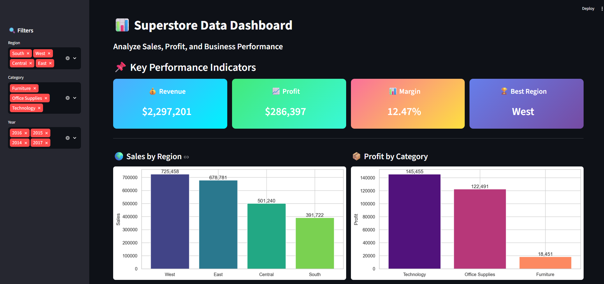
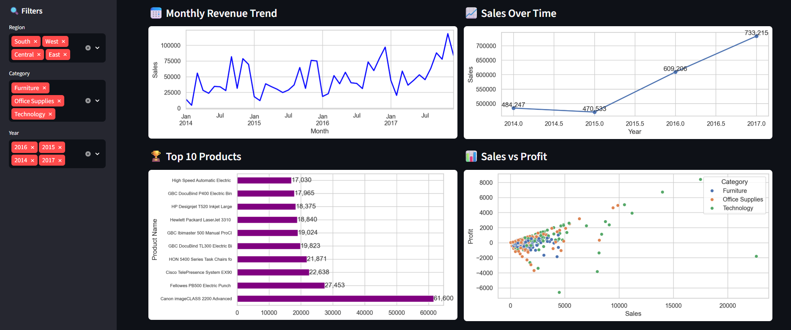
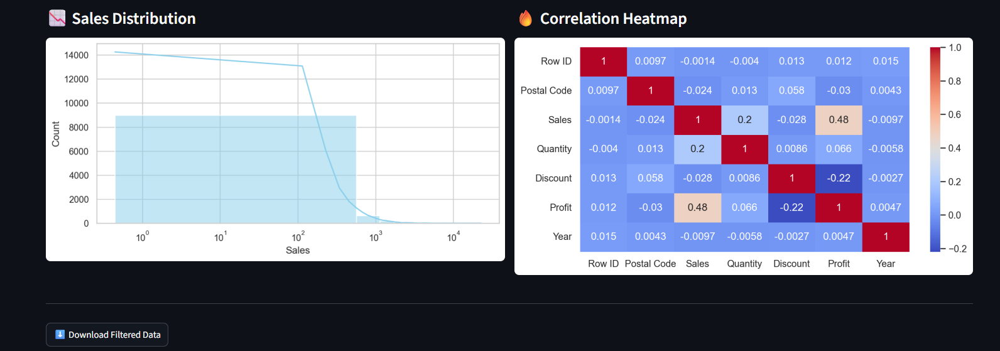

# 📊 Superstore Data Analysis & Interactive Dashboard

## 📌 Project Overview

This project focuses on analyzing the **Superstore dataset** to extract meaningful business insights and build an interactive dashboard for decision-making.

The project combines:
- Data cleaning and preprocessing
- Exploratory Data Analysis (EDA)
- KPI computation
- Data visualization
- Interactive dashboard development using Streamlit

---

## 🎯 Objectives

- Analyze sales and profit performance  
- Identify top-performing regions and product categories  
- Understand trends over time  
- Discover relationships between key variables  
- Build an interactive dashboard for dynamic data exploration  

---

## 📁 Dataset

The dataset used is the **Superstore dataset**, which contains:

- Sales  
- Profit  
- Product categories  
- Customer segments  
- Regions  
- Order dates  

---

## 📊 Dashboard Preview

### 🔹 Main Dashboard & KPIs

### 🔹 Trends & Product Analysis

### 🔹 Distribution & Correlation

---

## 📌 Key Insights

- The **West region** generates the highest sales, indicating strong demand and potential for business expansion.  
- The **Technology category** is the most profitable, suggesting higher profit margins.  
- Sales show a **consistent upward trend over time**, reflecting business growth.  
- Some high-sales transactions result in **negative profit**, indicating possible issues with discount strategies.  
- There is a **moderate positive relationship** between sales and profit.  

---

## 📈 Dashboard Features

### 🔍 Interactive Filters
- Region filter  
- Category filter  
- Year filter  

### 📌 Key Performance Indicators (KPIs)
- Total Revenue  
- Total Profit  
- Profit Margin  
- Best Performing Region  

### 📊 Visualizations
- Sales by Region  
- Profit by Category  
- Monthly Revenue Trend  
- Sales Over Time (Yearly Trend)  
- Top 10 Products by Sales  
- Sales vs Profit Scatter Plot  
- Sales Distribution (Histogram)  
- Correlation Heatmap  

### ⬇️ Additional Feature
- Download filtered dataset  

---

## 🛠️ Technologies Used

- Python  
- Pandas  
- Matplotlib  
- Seaborn  
- Streamlit  

---

## ▶️ How to Run the Notebook (analysis.ipynb)

1. Open Jupyter Notebook or VS Code  
2. Navigate to the project folder  
3. Run: `bash
          jupyter notebook

Open supersport.ipynb
5. Run all cells step-by-step

## ▶️ 🌐 How to Run the Dashboard (app.py)
    To run the Streamlit dashboard locally:
        streamlit run app.py

## ▶️ 🚀 Live Demo

If deployed online, access the dashboard here:

    https://your-app-name.streamlit.app

## 📂 Project Structure

project/
│
├── Superstore.ipynb
├── app.py
├── Superstore Dataset/ Sample - Superstore.csv
├── README.md
├── requirements.txt
└── assets/
    ├── dashboard_kpi.png
    ├── dashboard_trends.png
    └── dashboard_distribution.png

    